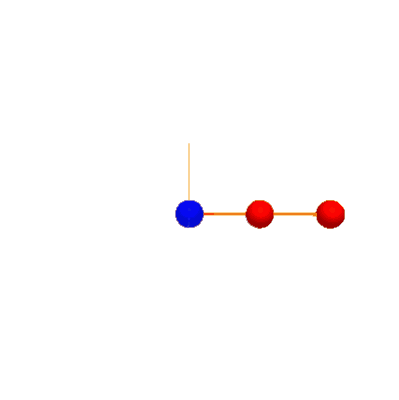
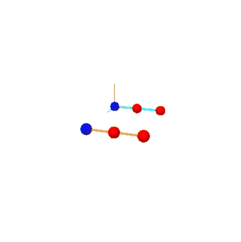
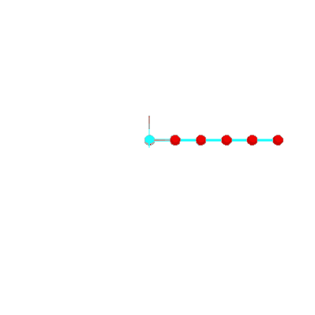

# Mass Spring System

Here we use the ASC-ODE package to simulate
a mass-spring system using different time-stepper methods. 
The expected output is a conservation of energy shown by a closed circle in the phase plot or a constant amplitude of the time evolution.

## Explicit Euler

A rise of amplitude in the time evolution can be seen, showing that the Explicit Euler method does'nt conserve energy.

## Implicit Euler

Like the Explicit Euler method, the Implicit Euler method also does'nt conserve energy, leading to a falling amplitude in the time evolution.

## Improved Euler (with step size h=0.1)

Other than the previous two methods, the Improved Euler Method shows a better energy preservation which can be seen by the eliptic trajectory of the phase plot or the conservation of the amplitude on the time evolution plot. 
While this method is stable, a low step size is required. 

## Crank-Nicolson

Other than the Improved Euler method. The Crank-Nicolson method is unconditionably stable, leading to a very good energy preservation. The downside is a higher computational cost. 

## Mass-Spring-System Simulation
Here are example gifs of systems, build using this library. 
They can be found and played with through the following python-notebooks in the `\mechsystem` folder: 
- `.\mass_spring.ipynb`
- `.\beams.ipynb`
- `.\spinning_top.ipynb`

The objects in this simulations are color coded: 
- Blue Dot: Fixed point
- Red Dot: Mass point
- Blue line: Spring connecting points
- Orange line: Constraint holding two points

### mass_spring.ipynb:
On this notbook different variations have been created simulating chains with various lengths. 

The following can be set by changing the `mode` value in the second cell in the notebook:
- DoublePendulumWithSprings
- DoublePendulumWithConstraints
- CompareDoublePendulums
- ChainWithSprings

#### DoublePendulumWithSprings
Here two masses have been connected via stiff springs to simulate a double pendulum. Note the shaking of the mass between the fixed point and the outer mass. 

#### DoublePendulumWithConstraints
Here the double pendulum has been realised using constraints (notice the orange color connecting them). The simulation is way "smoother" than the spring version.

#### CompareDoublePendulums
This Simulations shows the difference between the spring- and the constraint- implementation. At first no difference can be seen. After a certain point though, those simulations are diverging apart. 

#### ChainWithSprings
Here multiple masses have been connected with springs forming a longer chain. Note the twitching of the first mass.

### beams.ipynb:
On this notebook a beam-structure has been created with a initial (upward-)force applied on the bottom right edge.

The following values can be changed on the second cell in the notebook:
- height = 1 (height of the beam structure)
- length  = 1 (length of the beam structure between each point)
- beamstrength = 100000 (stiffnes of the spring connecting the points)
- force = (0,30,0) (Force applied on the bottom right point)

### spinning_top.ipynb:
In this simulation a tetrahedron has been created with a rotational force on all 3 mass points normal to it's center. 

This should result in the spinning-top not falling through the gravity.

The following values can be changed on the second cell in the notebook:
- massVal = 1.0 (Mass of each point)
- length = 2 (length between each point)
- totalForce = 10 (Total force applied per point at the start)

Note that gyrosopic precession (the counter-clockwise movement around it's fixed point) can also be seen in this simulation. 